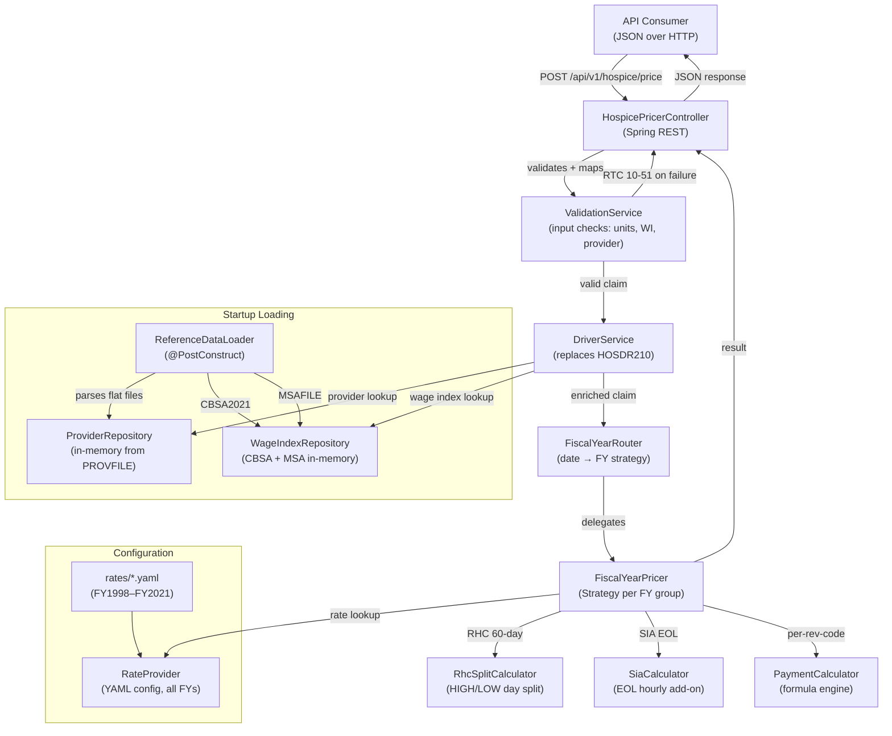

# COBOL-to-Java Migration Design

**Spec**: `.specs/features/cobol-to-java-migration/spec.md`
**Status**: Draft

---

## Architecture Overview



---

## Code Reuse Analysis

### COBOL-to-Java Mapping

| COBOL Component | Java Component | Reuse Strategy |
|----------------|----------------|----------------|
| HOSDR210 (driver) | `DriverService` | Rewrite — orchestration logic simplified |
| HOSPR210 (pricer, 24 FY blocks) | `FiscalYearPricer` + `PaymentCalculator` | Extract common formula, parameterize by rates |
| HOSPRATE (copybook) | `rates/*.yaml` config files | Rates externalized to YAML |
| BILL-315-DATA (315 bytes) | `HospiceClaim` / `PricingResult` DTOs | Clean domain model |
| CBSA2021 (flat file) | `WageIndexRepository` | Parse flat file at startup |
| PROV-TABLE (in-memory) | `ProviderRepository` | Parse flat file at startup |
| MSA-WI-TABLE | `WageIndexRepository` (MSA partition) | Parse flat file at startup |
| GENDATA.cbl (test data) | JUnit parameterized test data | Test cases as Java constants |

### Key Refactoring Opportunities

| COBOL Pattern | Java Pattern | Benefit |
|--------------|-------------|---------|
| 24 duplicate FY paragraphs | Strategy pattern with shared `PaymentCalculator` | Eliminate 5,000+ lines of duplication |
| Hard-coded rates (FY1998–2015) | YAML config for ALL FYs | Auditability, no recompile for rate changes |
| Sequential IF routing | `TreeMap<LocalDate, FiscalYearStrategy>` lookup | O(log n) vs O(n), self-documenting |
| COBOL date arithmetic (`INTEGER-OF-DATE`) | `java.time.LocalDate` / `ChronoUnit.DAYS` | Cleaner, no manual epoch conversion |
| Fixed-width 315-byte record | Clean Java DTOs with JSON serialization | Modern API contract |

---

## Components

### 1. HospicePricerController

- **Purpose**: REST endpoint — receives JSON claim, returns pricing result
- **Location**: `src/main/java/com/cms/hospice/api/HospicePricerController.java`
- **Interfaces**:
  - `POST /api/v1/hospice/price` — `PricingRequest → PricingResponse`
  - `GET /api/v1/hospice/health` — Health check with data loading status
- **Dependencies**: `DriverService`, request/response DTOs
- **Reuses**: Standard Spring Boot REST patterns

### 2. DriverService

- **Purpose**: Orchestrates claim processing — replaces HOSDR210
- **Location**: `src/main/java/com/cms/hospice/service/DriverService.java`
- **Interfaces**:
  - `PricingResult priceClaim(HospiceClaim claim)` — full pricing pipeline
- **Dependencies**: `ProviderRepository`, `WageIndexRepository`, `ValidationService`, `FiscalYearRouter`
- **Reuses**: Orchestration pattern from HOSDR210 (provider lookup → WI lookup → route to pricer)

### 3. ValidationService

- **Purpose**: Input validation producing RTC error codes
- **Location**: `src/main/java/com/cms/hospice/service/ValidationService.java`
- **Interfaces**:
  - `Optional<ReturnCode> validate(HospiceClaim claim)` — returns empty if valid, RTC if invalid
- **Dependencies**: None (pure validation)
- **Validation rules**:
  - RTC=10: Any units > 1,000
  - RTC=20: Rev 0652, units < 8, FY ≤ 2006
  - RTC=40: Provider WI zero/invalid
  - RTC=50: Beneficiary WI zero/invalid

### 4. FiscalYearRouter

- **Purpose**: Routes claim to correct FY pricing strategy based on FROM-DATE
- **Location**: `src/main/java/com/cms/hospice/service/FiscalYearRouter.java`
- **Interfaces**:
  - `FiscalYearStrategy resolve(LocalDate fromDate)` — returns the FY strategy
- **Implementation**: `NavigableMap<LocalDate, FiscalYearStrategy>` populated at startup
- **FY boundaries** (key dates):

  | Boundary Date | FY Strategy |
  |--------------|-------------|
  | 2020-10-01 | FY2021 |
  | 2019-10-01 | FY2020 |
  | ... | ... |
  | 2016-01-01 | FY2016.1 (RHC split + SIA) |
  | 2015-10-01 | FY2016 |
  | 2013-10-01 | FY2014 (QIP introduced) |
  | ... | ... |
  | 2007-01-01 | FY2007.1 (CHC 15-min units) |
  | 2006-10-01 | FY2007 |
  | ... | ... |
  | 2001-04-01 | FY2001-A |
  | 2000-10-01 | FY2001 |
  | ... (back to FY1998) | |

### 5. FiscalYearStrategy (Interface + Implementations)

- **Purpose**: Encapsulates FY-specific pricing logic
- **Location**: `src/main/java/com/cms/hospice/pricing/FiscalYearStrategy.java`
- **Interfaces**:
  - `PricingResult price(HospiceClaim claim, FiscalYearRates rates)` — calculate all rev codes
- **Implementations** (3 strategy groups to eliminate duplication):

  | Strategy Class | Covers FYs | Key Logic |
  |---------------|-----------|-----------|
  | `SimplePricerStrategy` | FY1998–FY2006 | Basic formula, CHC in hours, min 8h check |
  | `TransitionPricerStrategy` | FY2007–FY2013 (+ FY2007.1, FY2001-A) | CHC 15-min units, threshold 32, no QIP |
  | `ModernPricerStrategy` | FY2014–FY2015 | QIP support, no 60-day split |
  | `FullPricerStrategy` | FY2016–FY2021 (+ FY2016.1) | QIP + 60-day split + SIA |

- **Reuses**: Shared `PaymentCalculator` for the core formula

### 6. PaymentCalculator

- **Purpose**: Core formula engine — `(LS × WI + NLS) × units` and variants
- **Location**: `src/main/java/com/cms/hospice/pricing/PaymentCalculator.java`
- **Interfaces**:
  - `BigDecimal calculatePerDiem(BigDecimal ls, BigDecimal nls, BigDecimal wageIndex, int units)` — RHC/IRC/GIC
  - `BigDecimal calculateHourly(BigDecimal ls, BigDecimal nls, BigDecimal wageIndex, int units)` — CHC ≥8h
  - `BigDecimal calculateHourlyFromQuarters(BigDecimal ls, BigDecimal nls, BigDecimal wageIndex, int quarterUnits)` — CHC FY2007.1+ ≥32 units
- **Dependencies**: None (pure math, uses `BigDecimal` with `HALF_UP` rounding to match COBOL `ROUNDED`)

### 7. RhcSplitCalculator

- **Purpose**: 60-day HIGH/LOW rate split for RHC (FY2016.1+)
- **Location**: `src/main/java/com/cms/hospice/pricing/RhcSplitCalculator.java`
- **Interfaces**:
  - `RhcSplitResult calculate(LocalDate serviceDate, LocalDate admissionDate, int priorBenefitDays, int units, FiscalYearRates rates, BigDecimal wageIndex, boolean isQip)`
- **Returns**: `RhcSplitResult { highDays, lowDays, highPayment, lowPayment, totalPayment }`

### 8. SiaCalculator

- **Purpose**: Service Intensity Add-on (EOL) calculation (FY2016.1+)
- **Location**: `src/main/java/com/cms/hospice/pricing/SiaCalculator.java`
- **Interfaces**:
  - `SiaResult calculate(int[] eolDayUnits, FiscalYearRates rates, BigDecimal beneWageIndex, boolean isQip)`
- **Returns**: `SiaResult { dayPayments[7], totalPayment, hasSia }`
- **Cap logic**: units ≥ 16 → 4 hours; else units / 4

### 9. RateProvider

- **Purpose**: Loads and serves FY rate constants from YAML configuration
- **Location**: `src/main/java/com/cms/hospice/config/RateProvider.java`
- **Interfaces**:
  - `FiscalYearRates getRates(String fiscalYear)` — returns all rates for a FY
- **Config location**: `src/main/resources/rates/` (one YAML per FY or consolidated)
- **Dependencies**: Spring `@ConfigurationProperties` or custom loader

### 10. WageIndexRepository

- **Purpose**: In-memory lookup of CBSA and MSA wage indices
- **Location**: `src/main/java/com/cms/hospice/data/WageIndexRepository.java`
- **Interfaces**:
  - `Optional<BigDecimal> findCbsaWageIndex(String cbsaCode, LocalDate effectiveDate, LocalDate fyBegin, LocalDate fyEnd)`
  - `Optional<BigDecimal> findMsaWageIndex(String msaCode)`
- **Dependencies**: Flat file parsers

### 11. ProviderRepository

- **Purpose**: In-memory lookup of provider data
- **Location**: `src/main/java/com/cms/hospice/data/ProviderRepository.java`
- **Interfaces**:
  - `Optional<ProviderData> findByProviderNumber(String providerNumber)`
- **Dependencies**: Flat file parser for 240-byte provider records

### 12. ReferenceDataLoader

- **Purpose**: Parses COBOL flat files at startup and populates repositories
- **Location**: `src/main/java/com/cms/hospice/data/ReferenceDataLoader.java`
- **Interfaces**:
  - `void loadAll()` — called via `@PostConstruct`
- **Parsers**: Fixed-width parsing for CBSA (80 bytes), MSA (80 bytes), Provider (240 bytes)

---

## Data Models

### HospiceClaim (Input DTO — maps to BILL-315-DATA)

```java
public record HospiceClaim(
    String npi,                      // BILL-NPI (10)
    String providerNumber,           // BILL-PROV-NO (6)
    LocalDate fromDate,              // BILL-FROM-DATE
    LocalDate admissionDate,         // BILL-ADMISSION-DATE
    String providerCbsa,             // BILL-PROV-CBSA (5)
    String beneficiaryCbsa,          // BILL-BENE-CBSA (5)
    BigDecimal providerWageIndex,    // BILL-PROV-WAGE-INDEX
    BigDecimal beneficiaryWageIndex, // BILL-BENE-WAGE-INDEX
    int priorBenefitDays,            // BILL-NA-ADD-ON-DAY1-UNITS
    int priorBenefitDays2,           // BILL-NA-ADD-ON-DAY2-UNITS
    int[] eolAddOnDayUnits,          // BILL-EOL-ADD-ON-DAY1-7-UNITS (7)
    String qipIndicator,             // BILL-QIP-IND ("1" or " ")
    RevenueLineItem[] lineItems      // 4 revenue code groups
) {}

public record RevenueLineItem(
    String revenueCode,              // BILL-REVn (4)
    String hcpcCode,                 // BILL-HCPCn (5)
    LocalDate dateOfService,         // BILL-LINE-ITEM-DOSn
    int units                        // BILL-UNITSn
) {}
```

### PricingResult (Output DTO)

```java
public record PricingResult(
    BigDecimal[] lineItemPayments,   // BILL-PAY-AMT1-4
    BigDecimal payAmountTotal,       // BILL-PAY-AMT-TOTAL
    String returnCode,               // BILL-RTC (00, 10, 20, 30, 40, 50, 51, 73, 74, 75, 77)
    int highRhcDays,                 // BILL-HIGH-RHC-DAYS
    int lowRhcDays,                  // BILL-LOW-RHC-DAYS
    BigDecimal[] eolAddOnDayPayments,// BILL-EOL-ADD-ON-DAY1-7-PAY (7)
    BigDecimal[] naAddOnPayments     // BILL-NA-ADD-ON-DAY1-2-PAY (2)
) {}
```

### FiscalYearRates (Rate Configuration)

```java
public record FiscalYearRates(
    String fiscalYear,
    BigDecimal rhcHighLs, BigDecimal rhcHighNls,  // RHC HIGH (FY2016.1+) or single RHC
    BigDecimal rhcLowLs, BigDecimal rhcLowNls,    // RHC LOW (FY2016.1+ only)
    BigDecimal chcLs, BigDecimal chcNls,           // CHC
    BigDecimal ircLs, BigDecimal ircNls,           // IRC
    BigDecimal gicLs, BigDecimal gicNls,           // GIC
    // QIP variants (null for pre-FY2014)
    BigDecimal rhcHighLsQ, BigDecimal rhcHighNlsQ,
    BigDecimal rhcLowLsQ, BigDecimal rhcLowNlsQ,
    BigDecimal chcLsQ, BigDecimal chcNlsQ,
    BigDecimal ircLsQ, BigDecimal ircNlsQ,
    BigDecimal gicLsQ, BigDecimal gicNlsQ,
    // Feature flags
    boolean hasQip,            // FY2014+
    boolean has60DaySplit,     // FY2016.1+
    boolean hasSia,            // FY2016.1+
    boolean chcIn15MinUnits,   // FY2007.1+
    boolean hasMinChc8Hours    // FY1998-FY2006 only
) {}
```

### ProviderData

```java
public record ProviderData(
    String npi,
    String providerNumber,
    LocalDate effectiveDate,
    LocalDate fyBeginDate,
    String cbsaGeoLoc,
    String msaGeoLoc,
    // ... other fields from 240-byte record as needed
) {}
```

### WageIndexEntry

```java
public record WageIndexEntry(
    String code,              // CBSA (5) or MSA (4+1)
    LocalDate effectiveDate,
    BigDecimal wageIndex      // stored as decimal: 1.0000
) {}
```

---

## Error Handling Strategy

| Error Scenario | Handling | User Impact |
|---------------|---------|-------------|
| Invalid JSON body | 400 Bad Request with field validation details | Client corrects input |
| Claim fails validation (RTC 10-51) | 200 OK with RTC error code and zero payments | Matches COBOL behavior exactly |
| Provider not found | 200 OK with RTC=51 | Matches COBOL behavior |
| Reference data file not found at startup | Application fails to start with clear log message | Operator provides correct file paths |
| Unexpected calculation error | 500 Internal Server Error with correlation ID | No stack trace exposed |

**Key design decision**: Validation errors (RTC 10-51) return HTTP 200, not 4xx. These are **business-level** return codes, not protocol errors. The COBOL system processes these as normal output, and downstream systems expect the RTC in the response body.

---

## Tech Decisions

| Decision | Choice | Rationale |
|----------|--------|-----------|
| Java version | 21 (LTS) | User requirement; virtual threads, records, pattern matching |
| Framework | Spring Boot 4 | User requirement; latest version |
| Build tool | Maven | Standard for enterprise Java; matches Spring Boot conventions |
| Arithmetic | `BigDecimal` with `HALF_UP` | Matches COBOL `ROUNDED` behavior for financial calculations |
| FY routing | `NavigableMap<LocalDate, Strategy>` | Replaces fragile sequential IF chain; O(log n) lookup |
| Rate storage | YAML configuration files | Human-readable, auditable, no code change for rate updates |
| Reference data | In-memory repositories from flat files | Matches COBOL in-memory tables; no database needed for v1 |
| Test framework | JUnit 5 + parameterized tests | Standard; parameterized tests map naturally to TC01–TC36 |
| Package structure | By domain layer | `api`, `service`, `pricing`, `data`, `config`, `model` |

---

## Project Structure

```
hospice-pricer-api/
├── pom.xml
├── src/
│   ├── main/
│   │   ├── java/com/cms/hospice/
│   │   │   ├── HospicePricerApplication.java
│   │   │   ├── api/
│   │   │   │   ├── HospicePricerController.java
│   │   │   │   ├── PricingRequest.java
│   │   │   │   └── PricingResponse.java
│   │   │   ├── model/
│   │   │   │   ├── HospiceClaim.java
│   │   │   │   ├── PricingResult.java
│   │   │   │   ├── RevenueLineItem.java
│   │   │   │   ├── ReturnCode.java (enum)
│   │   │   │   ├── FiscalYearRates.java
│   │   │   │   ├── ProviderData.java
│   │   │   │   ├── WageIndexEntry.java
│   │   │   │   ├── RhcSplitResult.java
│   │   │   │   └── SiaResult.java
│   │   │   ├── service/
│   │   │   │   ├── DriverService.java
│   │   │   │   ├── ValidationService.java
│   │   │   │   └── FiscalYearRouter.java
│   │   │   ├── pricing/
│   │   │   │   ├── FiscalYearStrategy.java (interface)
│   │   │   │   ├── SimplePricerStrategy.java
│   │   │   │   ├── TransitionPricerStrategy.java
│   │   │   │   ├── ModernPricerStrategy.java
│   │   │   │   ├── FullPricerStrategy.java
│   │   │   │   ├── PaymentCalculator.java
│   │   │   │   ├── RhcSplitCalculator.java
│   │   │   │   └── SiaCalculator.java
│   │   │   ├── data/
│   │   │   │   ├── ReferenceDataLoader.java
│   │   │   │   ├── ProviderRepository.java
│   │   │   │   ├── WageIndexRepository.java
│   │   │   │   ├── CbsaFileParser.java
│   │   │   │   ├── MsaFileParser.java
│   │   │   │   └── ProviderFileParser.java
│   │   │   └── config/
│   │   │       ├── RateProvider.java
│   │   │       └── AppConfig.java
│   │   └── resources/
│   │       ├── application.yaml
│   │       ├── rates/
│   │       │   ├── fy1998.yaml
│   │       │   ├── fy1999.yaml
│   │       │   ├── ... (one per FY)
│   │       │   └── fy2021.yaml
│   │       └── data/
│   │           ├── CBSA2021
│   │           ├── MSAFILE
│   │           └── PROVFILE
│   └── test/
│       └── java/com/cms/hospice/
│           ├── regression/
│           │   └── CobolParityTest.java          (40 parameterized tests)
│           ├── pricing/
│           │   ├── PaymentCalculatorTest.java
│           │   ├── RhcSplitCalculatorTest.java
│           │   ├── SiaCalculatorTest.java
│           │   ├── SimplePricerStrategyTest.java
│           │   ├── TransitionPricerStrategyTest.java
│           │   ├── ModernPricerStrategyTest.java
│           │   └── FullPricerStrategyTest.java
│           ├── service/
│           │   ├── ValidationServiceTest.java
│           │   ├── FiscalYearRouterTest.java
│           │   └── DriverServiceTest.java
│           ├── data/
│           │   ├── CbsaFileParserTest.java
│           │   ├── MsaFileParserTest.java
│           │   └── ProviderFileParserTest.java
│           └── api/
│               └── HospicePricerControllerTest.java
```
